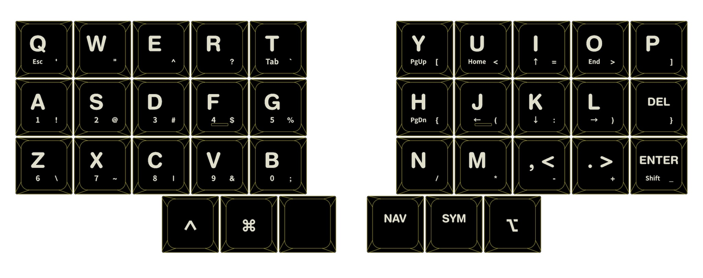

## LoremIpsum36 - A minimal Gateron LP column staggered keyboard

## Bill of Materials (BOM)

Quantity | Item
--- | ---
1 | RP2040-Zero
1 | LoremIpsum36 PCB
36 | Gateron LP switches and keycaps 
36 | SK-33 sockets
36 | 1N4148SOD-123 diodes
1 | LoremIpsum36 case
10 | M2×3 heat-set threaded inserts
10 | M2×12 countersunk screws

## Production Files

To place an order for the LoremIpsum36 PCB:

- Use the Gerber files available in the [production/](production/) folder.
- The [BOM](production/BOM.csv) and [CPL](production/CPL.csv) files can be used with a PCBA service -- especially if you prefer to avoid soldering small diodes.

All components (except the MCU) are soldered to the **back (bottom)** side of the board.

> [!CAUTION]
> To maintain the low profile of the board, the MCU (RP2040-Zero) must be soldered **on the front (top)** side of the PCB, with its components facing **downwards**. 

The boot/reset button should face the bottom side of the keyboard. Double-check alignment before soldering to avoid incorrect placement: 

The complete PCB design project is available in the [kicad/](kicad/) folder.

## 3D Printable Files

Print the case and plate using the provided [STL files](case/).

## Firmware

Precompiled VIA-enabled firmware:

- Flash `penk_loremipsum36_default.uf2` under [firmware/](firmware/) to the RP2040 MCU.
- Load the [via.json](firmware/QMK/keyboards/penk/loremipsum36/via.json) file in the `Design` tab for [VIA](https://usevia.app) configuration.

The QMK source is available under [firmware/QMK/keyboards/penk/loremipsum36](firmware/QMK/keyboards/penk/loremipsum36/).

### Default Keymaps 

The keymap is based on Rico's [rsta layout](https://github.com/rstacruz/my_qmk_keymaps/blob/main/preview.png), and the custom keycaps are made by FK Keycaps. 

You can order the same keycap set or customize yours at [https://fkcaps.com/custom/D7829J](https://fkcaps.com/custom/D7829J).

## Copyright and License
Copyright (c) 2025 Penk Chen. All rights reserved.

All files are licensed under the MIT license. For more information, see the [LICENSE](LICENSE).
